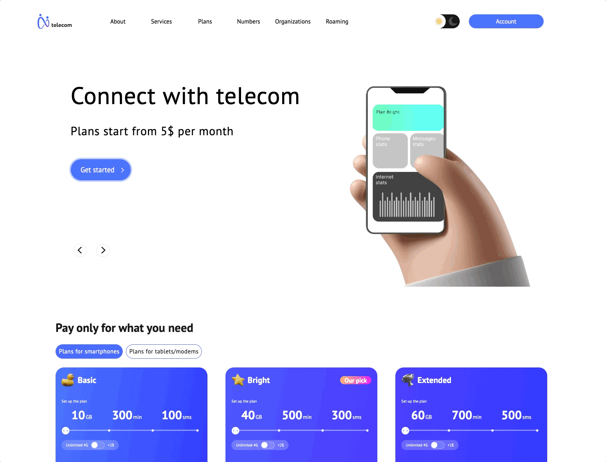

# Telecom Landing Page

React landing page with dark mode and animations 📡

- Routing
- Light/dark theme with saving to local storage
- Slider without the use of third-party libraries
- Rate cards with switches

## Interface



## Getting Started

Install Node.js v16 (Gallium):

https://nodejs.org/download/release/latest-gallium/

Install dependencies:

```shell script
npm install
```

Run for development:

```shell script
npm run start
```

Production build:

```shell
npm run build
```
